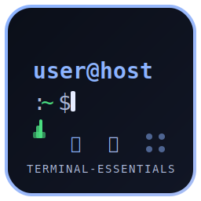

<div align="center">

# ⚡ Terminal-Essentials

### 🦅 *Aquila Azure Night Desktop — Suíte TUI para Linux*

<p align="center">
  
</p>

[](https://python.org)
[](https://textual.textualize.io/)
[](LICENSE)
[](https://github.com/DevFalconszz/terminal-essentials)

</div>

**Terminal-Essentials** transforma seu terminal em uma estação de comando completa com 12 aplicações TUI (Terminal User Interface) no tema **Áquila Azure Night** — azuis elétricos, tons escuros gelados e uma estética cyberpunk elegante.

Inclui um **Desktop Environment** no terminal com gerenciador de janelas, menu Iniciar, barra de tarefas, ícones na área de trabalho e atalhos de teclado.

---

## 🖥️ Desktop Environment

O `aquila_desktop_tui.py` é o hub central: uma interface desktop completa rodando dentro do terminal.

```
┌──────────────────────────────────────────────────────────────┐
│ ⚡ Terminal-Essentials  Áquila Azure Night          hostname │
├──────────────────────────────────────────────────────────────┤
│  ┌────────┐ ┌────────┐ ┌────────┐ ┌────────┐              │
│  │  Wi‑Fi │ │   BT   │ │  Proc  │ │  Sys   │              │
│  └────────┘ └────────┘ └────────┘ └────────┘              │
│  ┌────────┐ ┌────────┐ ┌────────┐ ┌────────┐              │
│  │  Arqs  │ │ Rádio  │ │ Notas  │ │ Clima  │              │
│  └────────┘ └────────┘ └────────┘ └────────┘              │
│  ┌────────┐ ┌────────┐ ┌────────┐ ┌────────┐              │
│  │  Cmd   │ │  Pomo  │ │  Dock  │ │ Musi   │              │
│  └────────┘ └────────┘ └────────┘ └────────┘              │
│                                                              │
│              Terminal-Essentials                             │
│       Ctrl+B → Bluetooth   Ctrl+W → Wi‑Fi   Ctrl+Q → Sair  │
│                                                              │
├──────────────────────────────────────────────────────────────┤
│ ⚡ Iniciar                                      🔋 12:58:09 │
└──────────────────────────────────────────────────────────────┘
```

**Funcionalidades do Desktop:**
- 🖱️ **Ícones clicáveis** na área de trabalho (grid 4×3)
- 📋 **Menu Iniciar** com todas as aplicações listadas
- 🪟 **Janelas flutuantes** com arrastar e redimensionar
- 📌 **Barra de tarefas** com alternância entre janelas
- ⌨️ **Atalhos de teclado**: `Ctrl+B` (Bluetooth), `Ctrl+W` (Wi‑Fi), `Ctrl+Q` (Sair)
- 💾 **Persistência de estado** — janelas e posições são salvas entre sessões

---

## 📦 Módulos

Cada módulo funciona de forma **independente** (`python3 aquila_*.py`) ou integrado ao Desktop.

| # | App | Arquivo | Descrição |
|---|-----|---------|-----------|
| 1 | 🌐 **Wi‑Fi** | `aquila_wifi_tui.py` | Gerenciar redes WiFi (scan, conectar, desconectar, ligar/desligar) |
| 2 | 🔵 **Bluetooth** | `aquila_bluetooth_tui.py` | Gerenciar dispositivos Bluetooth (scan, conectar, desconectar, power) |
| 3 | 📊 **Processos** | `aquila_process_tui.py` | Visualizar e gerenciar processos do sistema |
| 4 | 💻 **SysMon** | `aquila_sysmon_tui.py` | Monitor do sistema (CPU, memória, disco, rede) |
| 5 | 📁 **Arquivos** | `aquila_files_tui.py` | Navegador de arquivos no terminal |
| 6 | 📻 **Rádio Online** | `aquila_radio_tui.py` | Tocar rádios online via `mpv` |
| 7 | 📝 **Notas** | `aquila_notes_tui.py` | Bloco de notas com persistência em arquivo |
| 8 | 🌤 **Clima** | `aquila_weather_tui.py` | Previsão do tempo via wttr.in |
| 9 | 🔧 **Comandos** | `aquila_commands_tui.py` | Central de comandos úteis do Linux |
| 10 | 🍅 **Pomodoro** | `aquila_pomodoro_tui.py` | Timer Pomodoro com sessões foco/descanso |
| 11 | 🐳 **Docker** | `aquila_docker_tui.py` | Gerenciar containers Docker |
| 12 | 🎵 **Música** | `aquila_music_tui.py` | Player de música via terminal (`mpv`) |

---

## 🛠️ Pré-requisitos

| Requisito | Versão | Para quê |
|-----------|--------|----------|
| `python3` | 3.10+ | Runtime principal |
| `python3-venv` | — | Ambiente virtual isolado |
| `textual` | ≥0.52.0 | Framework TUI (instalado automaticamente) |
| `bluetoothctl` | — | Módulo Bluetooth |
| `nmcli` | — | Módulo Wi‑Fi |
| `mpv` | — | Rádio Online e Música |
| `docker` | — | Módulo Docker |
| Nerd Font | — | Ícones (recomendado) |

---

## 🚀 Instalação

### Rápida (Desktop)

```bash
git clone https://github.com/DevFalconszz/terminal-essentials.git
cd terminal-essentials
chmod +x run.sh
./run.sh
```

O `run.sh` cria automaticamente um ambiente virtual Python e instala as dependências.

### Manual (todos os módulos)

```bash
git clone https://github.com/DevFalconszz/terminal-essentials.git
cd terminal-essentials

# Ambiente virtual
python3 -m venv .venv
source .venv/bin/activate
pip install textual

# Módulos shell (Bluetooth, WiFi)
chmod +x bluetooth_manager.sh wifi_manager.sh
```

---

## 🎮 Como usar

### Desktop (recomendado)

```bash
./run.sh
```

### Módulos individuais

```bash
# Bluetooth
python3 aquila_bluetooth_tui.py

# Wi‑Fi
python3 aquila_wifi_tui.py

# Monitor do sistema
python3 aquila_sysmon_tui.py

# Gerenciar processos
python3 aquila_process_tui.py

# E assim por diante...
python3 aquila_files_tui.py
python3 aquila_radio_tui.py
python3 aquila_notes_tui.py
python3 aquila_weather_tui.py
python3 aquila_commands_tui.py
python3 aquila_pomodoro_tui.py
python3 aquila_docker_tui.py
python3 aquila_music_tui.py
```

### Fallback shell (Bluetooth e WiFi)

```bash
./bluetooth_manager.sh   # Interface whiptail
./wifi_manager.sh        # Interface whiptail
```

---

## ⌨️ Atalhos do Desktop

| Atalho | Ação |
|--------|------|
| `Ctrl+B` | Abrir Bluetooth Manager |
| `Ctrl+W` | Abrir Wi‑Fi Manager |
| `Ctrl+Q` | Sair do Desktop |
| Botão **Iniciar** | Abrir menu de aplicações |
| Ícones desktop | Clique para abrir app |
| Arrastar barra título | Mover janela |
| Arrastar ◢ | Redimensionar janela |

---

## 📂 Estrutura do Projeto

```
terminal-essentials/
├── aquila_desktop_tui.py      # Desktop environment principal
├── aquila_bluetooth_tui.py    # Gerenciador Bluetooth
├── aquila_wifi_tui.py         # Gerenciador Wi‑Fi
├── aquila_process_tui.py      # Gerenciador de processos
├── aquila_sysmon_tui.py       # Monitor do sistema
├── aquila_files_tui.py        # Navegador de arquivos
├── aquila_radio_tui.py        # Rádio online
├── aquila_notes_tui.py        # Bloco de notas
├── aquila_weather_tui.py      # Previsão do tempo
├── aquila_commands_tui.py     # Central de comandos
├── aquila_pomodoro_tui.py     # Timer Pomodoro
├── aquila_docker_tui.py       # Gerenciador Docker
├── aquila_music_tui.py        # Player de música
├── bluetooth_manager.sh       # Bluetooth fallback (whiptail)
├── wifi_manager.sh            # WiFi fallback (whiptail)
├── setup.sh                   # Instalação standalone (legado)
├── run.sh                     # Entry point do Desktop
├── requirements.txt           # Dependências Python
├── widgets/                   # Componentes do Desktop
│   ├── __init__.py
│   ├── start_menu.py          # Menu Iniciar
│   ├── taskbar.py             # Barra de tarefas
│   └── window.py              # Gerenciamento de janelas
├── assets/                    # Recursos
│   └── logo.svg               # Logotipo do projeto
└── README.md                  # Este arquivo
```

---

## 🎨 Tema Áquila Azure Night

Todas as aplicações compartilham a mesma paleta de cores:

| Cor | Uso | Hex |
|-----|-----|-----|
| ⬛ Fundo principal | Background | `#0b0f19` |
| ⬛ Card | Cartões / painéis | `#111625` |
| ⬛ Vidro | Bordas / destaques | `#181E2E` |
| 🟦 Azul | Destaques / botões | `#8DB4FF` |
| 🟦 Azul claro | Texto secundário | `#A7BDF5` |
| 🟪 Lavanda | Texto terciário | `#B8B7D9` |
| 🩷 Rosa | Botões destrutivos | `#D9B8CC` |
| ⬜ Texto | Corpo | `#E6ECFF` |
| 🟦 Muted | Rótulos | `#AAB6D6` |
| 🟩 Verde | Conectado / sucesso | `#4ade80` |
| 🟥 Vermelho | Erro | `#f87171` |

---

## 🧰 Tecnologias

- **[Textual](https://textual.textualize.io/)** — Framework TUI para Python (≥0.52.0)
- **Python 3.10+** — Runtime principal
- **asyncio** — Operações assíncronas (scan, refresh)
- **nmcli** — Gerenciamento de redes WiFi
- **bluetoothctl** — Gerenciamento Bluetooth
- **mpv** — Playback de áudio
- **whiptail** — Interface shell fallback

---

## 🤝 Contribuindo

1. Faça um *fork* do projeto
2. Crie sua *branch*: `git checkout -b minha-feature`
3. Commit suas mudanças: `git commit -m 'feat: adiciona ...'`
4. Push: `git push origin minha-feature`
5. Abra um *Pull Request*

Sugestões e *issues* são bem-vindas!

---

<div align="center">

**🦅 Feito para entusiastas de terminal e ricing de Linux**

[](https://github.com/DevFalconszz/terminal-essentials)

</div>
